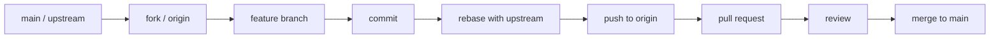

# Tổng hợp kiến thức về Git

Tài liệu này được viết theo hướng vừa dễ học vừa đủ chi tiết để dùng làm tài liệu tham khảo khi làm việc thực tế với Git. Nội dung đi từ khái niệm nền tảng, thao tác hằng ngày, đến quy trình làm việc nhóm bằng Git Flow và một số case studies thường gặp.

---

## Bài 1: Git Introduction

### 1. Git là gì?
Git là một Hệ thống Quản lý Phiên bản Phân tán (Distributed Version Control System - DVCS). Nó được thiết kế để theo dõi sự thay đổi của tệp tin theo thời gian, thường là mã nguồn, đồng thời giúp nhiều người có thể làm việc chung trên cùng một dự án mà vẫn kiểm soát được lịch sử và chất lượng thay đổi.

Điểm quan trọng của Git không chỉ nằm ở việc lưu lại file, mà còn ở chỗ nó lưu lại lịch sử phát triển của dự án dưới dạng các lần chụp trạng thái. Nhờ vậy, bạn có thể quay lại phiên bản cũ, so sánh thay đổi, xem ai sửa gì, và phối hợp công việc nhóm hiệu quả hơn.

### 2. Đặc điểm cốt lõi của Git
**Phân tán (Distributed)**

Mỗi lập trình viên không chỉ có một bản sao code hiện tại, mà còn có toàn bộ lịch sử commit ngay trên máy của mình. Điều này giúp Git hoạt động nhanh, và ngay cả khi máy chủ remote gặp sự cố, dữ liệu vẫn còn ở các bản sao local khác.

**Snapshot, không phải chỉ là difference**

Git không lưu kiểu “dòng nào thay đổi so với trước” theo nghĩa đơn giản như nhiều người vẫn nghĩ. Mỗi lần commit, Git chụp lại trạng thái của toàn bộ hệ thống tệp tại thời điểm đó. Nếu một file không thay đổi, Git chỉ lưu tham chiếu tới dữ liệu đã có trước đó.

**Tối ưu cho cộng tác**

Git được thiết kế để hỗ trợ làm việc nhóm: tạo nhánh, gộp nhánh, kiểm tra thay đổi, xử lý conflict, và đẩy code lên máy chủ chung một cách an toàn.

### 3. Ba trạng thái chính trong Git
Trong workflow cơ bản, một thay đổi thường đi qua 3 vùng chính:

1. **Working Directory**: nơi bạn trực tiếp chỉnh sửa file.
2. **Staging Area**: nơi bạn chuẩn bị những thay đổi muốn đưa vào commit tiếp theo.
3. **Git Directory / Repository**: nơi lưu lịch sử commit và toàn bộ metadata của repo.

Nói ngắn gọn: sửa file ở Working Directory, chọn file đưa vào Staging Area bằng `git add`, rồi tạo commit để lưu vào Repository.

### 4. Git khác gì GitHub?
- **Git** là công cụ quản lý phiên bản chạy trên máy của bạn.
- **GitHub** là nền tảng dịch vụ web để lưu trữ repository Git và hỗ trợ cộng tác.
- **GitLab / Bitbucket** cũng là những nền tảng tương tự GitHub.

Git là “động cơ”, còn GitHub là “nơi đặt xe và chia sẻ xe”. Bạn dùng Git để thao tác với lịch sử source code, và dùng GitHub để đồng bộ, review, tạo pull request, hoặc quản lý dự án nhóm.

### 5. Cài đặt và cấu hình ban đầu
Sau khi cài Git, bước đầu tiên nên làm là cấu hình danh tính người dùng để commit có thể ghi nhận đúng tác giả.

```bash
git config --global user.name "Tên của bạn"
git config --global user.email "Email của bạn"
```

Một số cấu hình hữu ích khác:

```bash
git config --global init.defaultBranch main
git config --global core.editor "code --wait"
```

### 6. Cách xem trợ giúp
Git có tài liệu trợ giúp ngay trên terminal. Một số cách dùng phổ biến:

```bash
git help <ten_lenh>
git <ten_lenh> --help
git <ten_lenh> -h
```

Khi chưa nhớ cú pháp chính xác, đây là cách nhanh nhất để tra cứu ngay tại chỗ.

---

## Bài 2: Git Basics

### 1. Quy trình làm việc cơ bản
Trong một workflow đơn giản, thay đổi đi theo chuỗi sau:

**Working Directory -> Staging Area -> Local Repository -> Remote Repository**

Diễn giải từng bước:

- **Working Directory**: bạn sửa file, tạo file mới, xóa file, refactor code.
- **Staging Area**: bạn chọn chính xác những thay đổi nào sẽ được commit tiếp theo.
- **Local Repository**: commit được lưu lại thành một snapshot trong lịch sử local.
- **Remote Repository**: code được đồng bộ lên máy chủ như GitHub hoặc GitLab.

### 2. Các lệnh cơ bản nhất
Đây là bộ lệnh bạn sẽ dùng rất thường xuyên:

```bash
git init
git clone <url>
git status
git add <ten_file>
git add .
git commit -m "Thong diep commit"
git log
git push
git pull
```

Ý nghĩa của từng lệnh:

- `git init`: khởi tạo một repository Git mới trong thư mục hiện tại.
- `git clone <url>`: sao chép toàn bộ repository từ remote về máy.
- `git status`: xem trạng thái hiện tại của file, file nào bị sửa, file nào đang staged.
- `git add`: đưa thay đổi vào staging.
- `git commit`: lưu lại một phiên bản có ý nghĩa.
- `git log`: xem lịch sử commit.
- `git push`: đẩy commit lên remote.
- `git pull`: tải code từ remote về và gộp vào nhánh hiện tại.

### 3. Commit là gì?
Commit là một bản chụp trạng thái của dự án tại một thời điểm cụ thể. Mỗi commit thường chứa:

- mã nguồn ở trạng thái được chọn;
- thông tin tác giả;
- thời gian tạo;
- message mô tả thay đổi;
- tham chiếu tới commit trước đó.

Một commit tốt nên mô tả một thay đổi logic rõ ràng, ví dụ:

```bash
git commit -m "Add login validation"
git commit -m "Fix null pointer in cart calculation"
```

### 4. Các biến thể commit thường gặp
**Commit bình thường**

```bash
git commit -m "Message"
```

**Commit kèm add tự động cho file tracked**

```bash
git commit -a -m "Message"
```

Lưu ý: cách này chỉ áp dụng cho file đã được Git theo dõi trước đó, không áp dụng cho file mới hoàn toàn.

**Sửa commit cuối cùng**

```bash
git commit --amend
git commit --amend -a
```

Tác dụng chính là sửa message commit cuối hoặc bổ sung file bị quên. Cần cẩn thận nếu commit đó đã được push lên remote.

### 5. Push và upstream
Sau khi có commit ở local, bạn đẩy lên remote bằng `git push`.

```bash
git push
git push -u origin <ten_nhanh>
```

Trong đó:

- `git push`: đẩy các commit mới lên branch remote tương ứng.
- `git push -u origin <ten_nhanh>`: thiết lập tracking giữa branch local và branch remote.

Lệnh `-u` rất hữu ích khi bạn push branch mới lần đầu tiên.

### 6. Xóa file và hủy theo dõi
**Xóa file khỏi Git và khỏi máy**

```bash
git rm <file>
```

**Hủy theo dõi nhưng vẫn giữ file trên máy**

```bash
git rm -r --cached <thu_muc_hoac_file>
```

Trường hợp này thường dùng khi lỡ commit nhầm file lớn, file build, hoặc file chứa thông tin nhạy cảm. Sau khi bỏ theo dõi, bạn nên thêm nó vào `.gitignore` để tránh lặp lại.

### 7. `.gitignore` và ký tự đặc biệt
File `.gitignore` giúp Git bỏ qua những file/thư mục không muốn quản lý.

Một số ký tự thường dùng:

- `*`: khớp với 0 hoặc nhiều ký tự.
- `?`: khớp với đúng 1 ký tự.
- `[]`: khớp với một ký tự trong khoảng cho trước.
- `/`: dùng để chỉ rõ vị trí theo cây thư mục.
- `!`: phủ định một quy tắc đã bỏ qua trước đó.

Ví dụ:

```gitignore
*.log
build/
/todo.txt
!server.log
```

### 8. Các lệnh kiểm tra nhanh rất nên nhớ
- `git diff`: xem nội dung thay đổi chưa staged.
- `git diff --staged`: xem nội dung đã staged.
- `git restore <file>`: hoàn tác thay đổi ở Working Directory.
- `git restore --staged <file>`: bỏ file ra khỏi staging area.

---

## Bài 3: Git Branch

### 1. Branch là gì?
Branch trong Git là một con trỏ tới một commit cụ thể. Nhánh mặc định thường là `main` hoặc `master`, tùy cấu hình của repository.

Branch cho phép bạn tách riêng một hướng phát triển mới mà không ảnh hưởng đến nhánh chính. Đây là cơ chế cốt lõi để làm feature, fix bug, hoặc thử nghiệm ý tưởng mới.

### 2. HEAD là gì?
`HEAD` là con trỏ đặc biệt cho biết bạn đang đứng ở đâu trong lịch sử Git. Thông thường `HEAD` sẽ trỏ vào branch hiện tại, và branch đó lại trỏ vào commit mới nhất của nó.

Nói đơn giản:

- `HEAD` cho biết “bạn đang ở nhánh nào”.
- Branch cho biết “nhánh đó đang trỏ tới commit nào”.

### 3. Các lệnh quản lý branch
```bash
git branch
git branch -a
git branch <ten_nhanh_moi>
git branch -m <ten_moi>
git branch -d <ten_nhanh>
git branch -D <ten_nhanh>
```

Ý nghĩa:

- `git branch`: liệt kê các branch local.
- `git branch -a`: liệt kê cả local và remote branch.
- `git branch <ten_nhanh_moi>`: tạo branch mới nhưng chưa chuyển sang.
- `git branch -m <ten_moi>`: đổi tên branch hiện tại.
- `git branch -d <ten_nhanh>`: xóa branch nếu đã merge.
- `git branch -D <ten_nhanh>`: xóa cưỡng bức.

### 4. Chuyển nhánh và tạo nhánh nhanh
Bạn có thể dùng `checkout` hoặc `switch`.

```bash
git checkout <ten_nhanh>
git checkout -b <ten_nhanh_moi>

git switch <ten_nhanh>
git switch -c <ten_nhanh_moi>
```

Từ Git 2.23 trở đi, `git switch` được khuyến nghị hơn vì rõ nghĩa hơn: chỉ dùng để chuyển branch hoặc tạo branch mới.

### 5. Khi nào nên tạo branch?
Thông thường, mỗi nhiệm vụ nên có một branch riêng:

- một tính năng mới;
- một bug fix;
- một refactor nhỏ;
- một thử nghiệm tạm thời.

Điều này giúp lịch sử commit dễ đọc hơn, việc review dễ hơn, và xung đột cũng dễ cô lập hơn.

### 6. Quy ước đặt tên branch
Nên đặt tên có ngữ nghĩa rõ ràng, ví dụ:

```text
feature/login
fix/payment-error
refactor/user-service
hotfix/security-patch
```

Một quy ước đơn giản như `feature/`, `fix/`, `hotfix/`, `refactor/` đã đủ tốt cho đa số team nhỏ và vừa.

---

## Bài 4: Git rebase, git merge

### 1. Git merge là gì?
Merge là cách gộp lịch sử của một branch vào branch khác. Đây là cách phổ biến nhất khi kết thúc một nhánh tính năng.

Quy trình thường là:

```bash
git switch main
git merge <ten_nhanh_phu>
```

### 2. Các kiểu merge
**Fast-forward merge**

Nếu branch đích chưa có commit mới nào kể từ lúc branch phụ được tách ra, Git chỉ “trượt” con trỏ branch đích lên commit cuối của branch phụ.

**3-way merge**

Nếu cả hai branch đều có commit mới, Git sẽ tìm commit chung gần nhất và tạo một merge commit để nối hai lịch sử lại với nhau.

### 3. Ưu và nhược điểm của merge
**Ưu điểm**

- Giữ nguyên lịch sử thật của dự án.
- Dễ nhìn thấy thời điểm branch được gộp.
- An toàn vì không viết lại lịch sử.

**Nhược điểm**

- Nếu dự án lớn và merge thường xuyên, lịch sử có thể rối, nhiều merge commit.

### 4. Git rebase là gì?
Rebase là thao tác “bứng” các commit của branch hiện tại rồi đặt chúng lên trên một base mới.

Ví dụ:

```text
A---B---C  main
     \
      D---E  feature
```

Sau rebase lên `main` mới:

```text
A---B---C---F  main
             \
              D'---E'  feature
```

`D'` và `E'` là commit mới được tạo lại, dù nội dung thay đổi có thể giống commit cũ.

### 5. Ưu và nhược điểm của rebase
**Ưu điểm**

- Lịch sử commit thẳng và sạch.
- Dễ đọc khi xem `git log`.
- Tránh tạo merge commit không cần thiết.

**Nhược điểm**

- Rebase viết lại lịch sử.
- Nếu dùng sai trên branch public, có thể làm đồng đội bị lệch lịch sử.

### 6. Golden rule của rebase
Không rebase branch đã public nếu branch đó đang được nhiều người dùng chung. Nói cách khác, chỉ rebase trên branch cá nhân hoặc branch chưa chia sẻ rộng rãi.

### 7. Khi nào nên dùng merge, khi nào nên dùng rebase?
- Dùng **merge** khi muốn giữ nguyên lịch sử thật và an toàn cho branch dùng chung.
- Dùng **rebase** khi muốn làm sạch lịch sử branch cá nhân trước khi gộp.

---

## Bài 5: Git pull, git fetch

### 1. Git fetch
`git fetch` kết nối tới remote repository và tải về các cập nhật mới, nhưng không tự động gộp vào branch hiện tại.

```bash
git fetch
git fetch origin <ten_nhanh>
git fetch --all
```

Đặc điểm quan trọng:

- an toàn;
- không làm thay đổi Working Directory;
- chỉ cập nhật thông tin remote-tracking branch như `origin/main`.

Nó rất phù hợp khi bạn muốn kiểm tra xem remote có gì mới trước khi quyết định gộp hay không.

### 2. Git pull
`git pull` là sự kết hợp của `git fetch` và sau đó tự động merge vào branch hiện tại.

```bash
git pull
git pull origin <ten_nhanh>
```

Bản chất:

```text
git pull = git fetch + git merge
```

Điểm mạnh của pull là nhanh và tiện. Điểm yếu là nếu local và remote cùng sửa một chỗ, bạn có thể gặp conflict ngay khi kéo code.

### 3. Pull với rebase
Ngoài merge mặc định, Git còn có chế độ pull với rebase:

```bash
git pull --rebase
```

Bản chất:

```text
git fetch + git rebase
```

Cách này thường giúp lịch sử thẳng hơn, đặc biệt khi bạn muốn đồng bộ branch cá nhân với branch chính trước khi push.

### 4. Phân biệt nhanh fetch và pull

| Tiêu chí | `git fetch` | `git pull` |
| --- | --- | --- |
| Bản chất | Chỉ tải dữ liệu về | Tải dữ liệu về và gộp vào branch hiện tại |
| Ảnh hưởng tới code | Không đổi code đang làm | Có thể đổi code hoặc phát sinh conflict |
| Độ an toàn | Rất an toàn | Cần cẩn thận hơn |
| Mục đích chính | Kiểm tra trước khi gộp | Đồng bộ nhanh để làm tiếp |

### 5. Nên dùng lệnh nào?
- Dùng `fetch` khi muốn kiểm tra trạng thái remote trước.
- Dùng `pull` khi bạn chấp nhận gộp ngay vào branch hiện tại.
- Dùng `pull --rebase` khi team ưu tiên lịch sử commit gọn hơn.

---

## Bài 6: Git Flow

### 1. Git Flow là gì?
Git Flow là một quy trình làm việc có cấu trúc, dùng để quản lý việc phát triển tính năng, sửa lỗi, phát hành và hotfix trong dự án.

Trong tài liệu này, Git Flow được trình bày theo mô hình thực tế đơn giản hơn, phù hợp với dự án nhỏ và vừa:

```text
fork -> clone -> add remote upstream -> tạo branch riêng -> commit -> rebase -> push -> pull request -> review -> merge
```

### 2. Vì sao cần Git Flow?
Nếu nhiều người cùng sửa trực tiếp trên `main`, dự án rất dễ xảy ra các vấn đề sau:

- code bị ghi đè;
- lịch sử commit rối;
- khó review;
- conflict xuất hiện liên tục;
- khó phát hành bản ổn định.

Git Flow giúp tách riêng vai trò của từng branch, làm rõ luồng làm việc và giảm rủi ro khi nhiều người cộng tác.

### 3. Các nhánh thường gặp trong Git Flow
- **`main`**: branch ổn định, chứa code đã sẵn sàng release.
- **`develop`**: branch tích hợp các thay đổi đang phát triển, nếu team dùng mô hình này.
- **`feature/*`**: branch cho từng tính năng.
- **`fix/*`** hoặc **`bugfix/*`**: branch cho sửa lỗi.
- **`hotfix/*`**: branch sửa lỗi khẩn cấp trên production.

Không phải dự án nào cũng cần đủ các nhánh này. Với team nhỏ, chỉ cần `main` và các branch ngắn hạn theo nhiệm vụ là đủ.

### 4. Một Git Flow đơn giản theo thực tế làm việc nhóm
**Bước 1: Fork repository**

Nếu bạn làm trên dự án open source hoặc repo không cho push trực tiếp, thường bạn fork repository gốc về tài khoản cá nhân.

**Bước 2: Clone repository đã fork**

```bash
git clone <url_fork>
cd <ten_project>
```

**Bước 3: Add remote upstream**

```bash
git remote add upstream <url_repo_goc>
git remote -v
```

Ý nghĩa:

- `origin`: repository của bạn.
- `upstream`: repository gốc của dự án.

**Bước 4: Tạo branch làm việc**

```bash
git switch main
git pull upstream main
git switch -c feature/login
```

**Bước 5: Làm việc và commit**

```bash
git status
git add .
git commit -m "Add login validation"
```

**Bước 6: Đồng bộ với upstream bằng rebase**

```bash
git fetch upstream
git rebase upstream/main
```

**Bước 7: Xử lý conflict nếu có**

```bash
git add .
git rebase --continue
```

**Bước 8: Push branch và tạo pull request**

```bash
git push -u origin feature/login
```

Sau đó tạo Pull Request từ branch của bạn vào branch mục tiêu của repo gốc.

### 5. Cách đọc flow này bằng trực giác
Flow trên có thể hiểu như sau:

1. Lấy code mới nhất từ repo gốc.
2. Tạo branch riêng để làm việc.
3. Commit theo từng logic nhỏ.
4. Rebase để cập nhật code mới nhất trước khi gửi review.
5. Push branch lên fork của mình.
6. Tạo Pull Request để team review và merge.

### 6. Best practices trong Git Flow
- Không code trực tiếp trên branch chính.
- Commit nên nhỏ và có ý nghĩa.
- Trước khi push PR, đồng bộ với branch mục tiêu.
- Ưu tiên `--force-with-lease` nếu bắt buộc phải push sau rebase.
- Không dùng `--force` bừa bãi trên branch dùng chung.

### 7. Sơ đồ tóm tắt


---

## Bài 7: Case Studies

### 1. Gộp nhiều commit thành một (Combine commits into one)
Khi bạn tạo quá nhiều commit nhỏ lẻ như sửa typo, chỉnh CSS, hoặc fix format, bạn có thể gộp chúng lại thành một commit duy nhất trước khi push.

**Cách 1: Dùng soft reset**

```bash
git reset --soft HEAD~3
git commit -m "Tin nhắn commit gộp mới"
```

`HEAD~3` nghĩa là lùi về trước 3 commit gần nhất, nhưng vẫn giữ nguyên các thay đổi trong staging area để bạn commit lại thành một commit mới.

**Cách 2: Dùng interactive rebase**

```bash
git rebase -i HEAD~3
```

Khi editor mở ra, đổi `pick` thành `squash` hoặc `s` ở những commit muốn gộp. Sau đó lưu lại, đóng file, và Git sẽ cho bạn nhập lại message commit mới.

### 2. Bỏ qua file đã lỡ commit (Ignore committed file)
Nếu bạn lỡ commit một file như `.env` hoặc thư mục `node_modules`, chỉ thêm nó vào `.gitignore` thôi là chưa đủ vì Git đã track nó rồi.

**Cách giải quyết:**

1. Xóa file đó khỏi bộ nhớ theo dõi của Git, nhưng vẫn giữ lại file vật lý trên máy:

```bash
git rm --cached <ten_file_hoac_thu_muc> -r
```

2. Thêm tên file hoặc thư mục đó vào `.gitignore`.
3. Commit lại thay đổi:

```bash
git commit -m "Untrack va ignore file nhay cam"
```

### 3. Đổi tên nhánh (Rename branch)
Bạn lỡ đặt tên nhánh sai chính tả hoặc sai quy ước của dự án.

**Nếu đang đứng ở nhánh cần đổi tên:**

```bash
git branch -m <ten_nhanh_moi>
```

**Nếu nhánh cũ đã được push lên remote:**

1. Đổi tên nhánh ở local.
2. Push nhánh mới lên remote:

```bash
git push origin -u <ten_nhanh_moi>
```

3. Xóa nhánh cũ trên remote:

```bash
git push origin --delete <ten_nhanh_cu>
```

### 4. Commit nhầm nhánh (Commit to other branch by mistake)
Bạn đang code và lỡ commit thẳng vào nhánh `main` thay vì branch `feature`.

**Cách giải quyết bằng cherry-pick:**

1. Lấy mã hash của commit vừa tạo bằng `git log`.
2. Chuyển sang nhánh đúng, hoặc tạo nhánh mới:

```bash
git checkout -b <nhanh_dung>
```

3. Bê commit đó sang nhánh mới:

```bash
git cherry-pick <ma_hash>
```

4. Quay lại nhánh sai nếu cần, rồi xóa commit nhầm bằng reset:

```bash
git checkout main
git reset --hard HEAD~1
```

### 5. Lỡ commit sai và muốn xóa bỏ (Commit by mistake and remove it)
Bạn tạo một commit chứa code lỗi hoặc phá hỏng tính năng, và muốn xử lý theo cách phù hợp với trạng thái local hay remote.

**Trường hợp 1: Chưa push lên remote**

```bash
git reset --hard HEAD~1
```

Lệnh này xóa hoàn toàn commit cuối cùng và đưa code về trạng thái trước đó.

**Trường hợp 2: Đã push lên remote**

Không nên dùng `reset --hard` vì sẽ làm lệch lịch sử trên remote. Khi đó nên dùng:

```bash
git revert <ma_hash_commit_sai>
```

`revert` tạo một commit mới để đảo ngược thay đổi của commit sai, thay vì xóa hẳn nó khỏi lịch sử.

### 6. Gộp commit từ nhánh khác sang (Combine commits from other branch)
Bạn đang ở nhánh `feature-A`, nhưng đồng nghiệp ở nhánh `feature-B` vừa có một commit rất hữu ích. Bạn không muốn merge cả nhánh, chỉ muốn lấy đúng commit đó.

**Cách giải quyết bằng cherry-pick:**

1. Đứng ở nhánh của bạn.
2. Lấy commit đích danh:

```bash
git cherry-pick <ma_hash_cua_commit_ben_nhanh_kia>
```

`cherry-pick` rất hữu ích khi bạn chỉ cần một thay đổi cụ thể, không cần kéo toàn bộ lịch sử của branch khác.

### 7. Đang code dở nhưng phải chuyển nhánh (In the middle of work but navigate to other branch)
Bạn đang viết dở code, chưa xong và chưa thể commit, nhưng cần chuyển sang branch khác để xử lý việc gấp.

**Cách giải quyết bằng stash:**

1. Cất code đang làm dở vào stash:

```bash
git stash
```

2. Chuyển sang nhánh khác để làm việc.
3. Khi quay lại, lấy code ra:

```bash
git stash pop
```

Nếu muốn giữ stash lại sau khi áp dụng, có thể dùng `git stash apply` thay vì `pop`.

### 8. Lỡ tay xóa mất một commit quan trọng (Remove important commit by mistake)
Bạn lỡ dùng `git reset --hard` hoặc xóa nhầm branch chứa commit quan trọng.

Git thường chưa xóa ngay dữ liệu đó, vì vậy có thể cứu lại bằng `reflog`.

1. Xem lịch sử di chuyển của HEAD:

```bash
git reflog
```

2. Tìm trạng thái trước khi lỡ tay xóa, copy mã hash cần khôi phục.
3. Khôi phục lại:

```bash
git reset --hard <ma_hash_can_khoi_phuc>
```

### 9. Đã merge nhưng đổi ý muốn hoàn tác (Merged but want to undo)
Bạn vừa merge một branch vào `main`, nhưng sau đó phát hiện branch đó có lỗi và muốn hoàn tác.

**Trường hợp 1: Mới merge ở local, chưa push**

```bash
git reset --hard <ma_hash_truoc_khi_merge>
```

**Trường hợp 2: Đã push lên remote**

Không nên reset lại lịch sử đã public. Thay vào đó, dùng commit đảo ngược merge:

```bash
git revert -m 1 <ma_hash_commit_merge>
```

`-m 1` cho Git biết giữ nhánh chính làm parent gốc khi revert merge commit.

---

## Kết luận ngắn
Nếu học Git theo đúng thứ tự từ khái niệm, thao tác cơ bản, branch, merge/rebase, fetch/pull, rồi đến Git Flow và case studies, ta sẽ hiểu được cả phần “dùng lệnh” lẫn phần “vì sao phải dùng như vậy”. Khi thực hành, điều quan trọng nhất là làm quen với `status`, `diff`, `add`, `commit`, `branch`, `fetch`, `merge`, `rebase` và đọc được lịch sử Git bằng `log`.